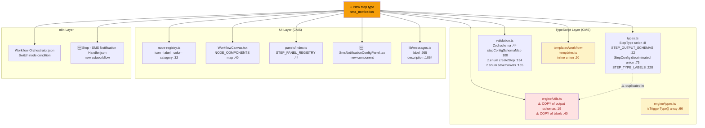
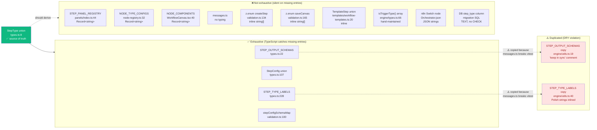
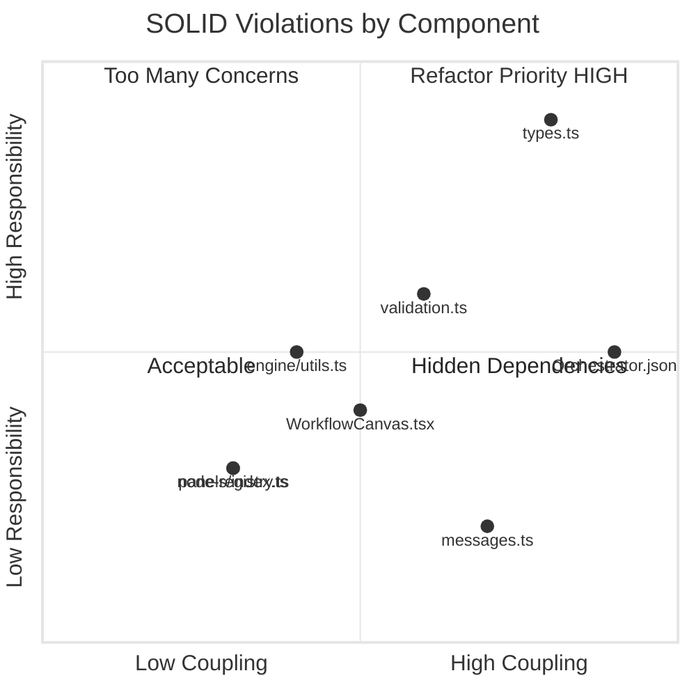
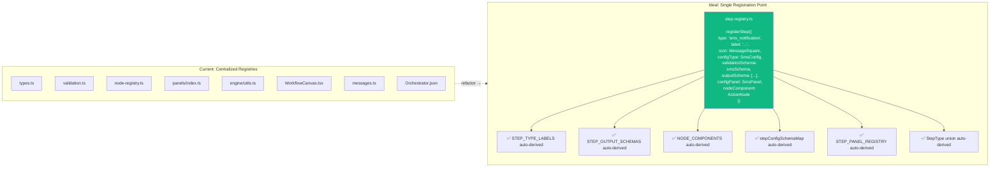

# Workflow Engine Extensibility Audit

> Generated: 2026-04-13 | Scope: Adding a new step type (e.g. `sms_notification`)

---

## TL;DR

**14 files** must change to add one step type. ~120–170 lines. ~60% boilerplate, ~15% pure duplication.
Only 4 of 14 registries have TypeScript exhaustive checking — the rest are silent on missing entries.

---

## Registration Tax — Summary Table

| # | File | Change needed | Lines | Type | TS exhaustive? |
|---|------|---------------|-------|------|----------------|
| 1 | `features/workflows/types.ts:8` | Add to `StepType` union | 1 | Boilerplate | — (source) |
| 2 | `features/workflows/types.ts:22` | Add to `STEP_OUTPUT_SCHEMAS` | 3–5 | Unique | ✅ Yes |
| 3 | `features/workflows/types.ts:75` | Add `StepConfigSmsNotification` type | 8–10 | Unique | ✅ Yes |
| 4 | `features/workflows/types.ts:228` | Add to `STEP_TYPE_LABELS` | 1 | Boilerplate | ✅ Yes |
| 5 | `features/workflows/engine/utils.ts:19` | Duplicate output schema (**DRY violation**) | 3–5 | ⚠️ Duplication | ❌ No |
| 6 | `features/workflows/engine/utils.ts:40` | Duplicate label (**DRY violation**) | 1 | ⚠️ Duplication | ❌ No |
| 7 | `features/workflows/validation.ts:44` | Add Zod schema + `stepConfigSchemaMap` entry | 8–12 | Unique | ✅ Yes |
| 8 | `features/workflows/validation.ts:134` | Add to `createStepSchema` z.enum | 1 | Boilerplate | ❌ No |
| 9 | `features/workflows/validation.ts:165` | Add to `saveCanvasSchema` z.enum | 1 | Boilerplate | ❌ No |
| 10 | `features/workflows/components/panels/index.ts:44` | Import + register panel component | 3 | Boilerplate | ❌ No |
| 11 | `features/workflows/components/panels/SmsNotificationConfigPanel.tsx` | **New file** — config panel UI | 60–100 | Unique | ❌ No |
| 12 | `features/workflows/components/nodes/node-registry.ts:32` | Add node visual config | 6 | Semi-unique | ❌ No |
| 13 | `features/workflows/components/WorkflowCanvas.tsx:40` | Add to `NODE_COMPONENTS` map | 1 | Boilerplate | ❌ No |
| 14 | `apps/cms/lib/messages.ts:955` | Add step label string | 1 | Boilerplate | ❌ No |
| 15 | `apps/cms/lib/messages.ts:1064` | Add step library description | 1 | Boilerplate | ❌ No |
| 16 | `features/workflows/templates/workflow-templates.ts:20` | Add to inline union | 1 | Boilerplate | ❌ No |
| 17 | `n8n-workflows/Workflow Orchestrator.json` | Add Switch condition + Execute Workflow node | ~20 JSON | Boilerplate | ❌ No |
| 18 | `n8n-workflows/Step - SMS Notification Handler.json` | **New subworkflow** | 50–100 JSON | Unique | ❌ No |

**Totals:** 12 modified + 2 new = **14 files** | **~120–170 lines** | 10 boilerplate · 4 unique · 2 duplication

---

## Visualization 1 — Registration Flow (Shotgun Surgery Map)

---

## Visualization 2 — Registry Map (Duplication & Type Safety)

---

## Visualization 3 — SOLID Violation Heatmap

### SOLID breakdown

| Principle | Status | Evidence |
|-----------|--------|----------|
| **Open/Closed** | ❌ Violated | 12 existing files must be modified per new step type. No plugin system. |
| **Single Responsibility** | ⚠️ Partial | `types.ts` mixes domain types + output schemas + display labels + dropdown options (~330 lines, 5 concerns) |
| **Liskov Substitution** | ✅ OK | `StepConfig` discriminated union handles this correctly |
| **Interface Segregation** | ⚠️ Partial | `ConfigPanelProps` mixes config data, callbacks, and trigger context |
| **Dependency Inversion** | ❌ Violated | `engine/utils.ts` hard-codes output schemas instead of depending on abstraction; `messages.ts` import issues force duplication |

---

## Visualization 4 — Path to Plugin Architecture

---

## Root Cause: Why `engine/utils.ts` Duplicates

The `messages.ts` file imports from CMS-specific modules that break vitest's module resolution. Rather than fixing the import boundary, `engine/utils.ts` inlined copies with a `// keep in sync` comment. This is the single change that would eliminate 2 of the 18 registration tax items:

**Fix:** Move `STEP_OUTPUT_SCHEMAS` to a framework-agnostic file (no `messages.ts` import), import it in both `types.ts` and `engine/utils.ts`.

---

## Quick Win vs Full Refactor

| Approach | Effort | Eliminates |
|----------|--------|------------|
| Fix `engine/utils.ts` duplication | ~30 min | 2 registration tax items |
| Change `Record<string>` → `Record<StepType>` in UI registries | ~1h | 6 silent failure points |
| Derive `StepType` from `as const` object | ~30 min | Hand-maintained union risk |
| Full plugin/registry pattern | ~1 day | Open/Closed violation entirely |
