# Workflow Engine — Diagrams

> Updated: 2026-05-01 | All diagrams in Mermaid format | Diagrams 9–12 added for T-210 retry engine

---

## 1. Component Diagram — System Overview

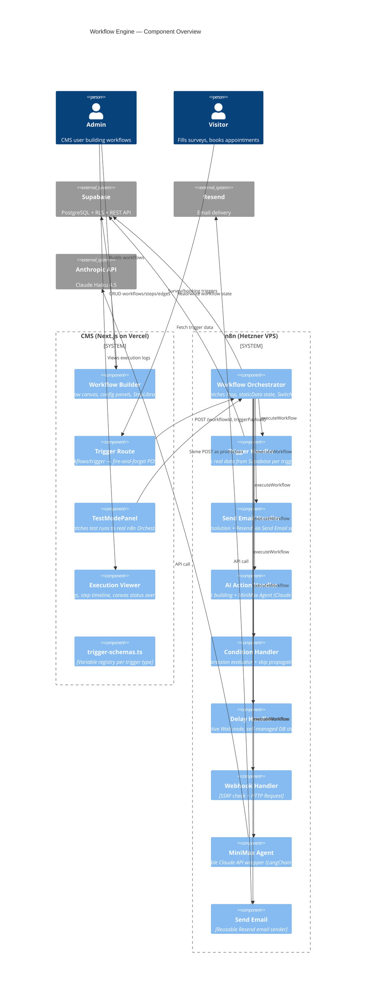

---

## 2. n8n Orchestrator Internal Flow

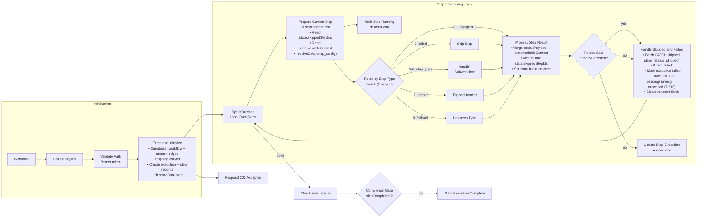

---

## 3. Trigger Handler Internal Flow

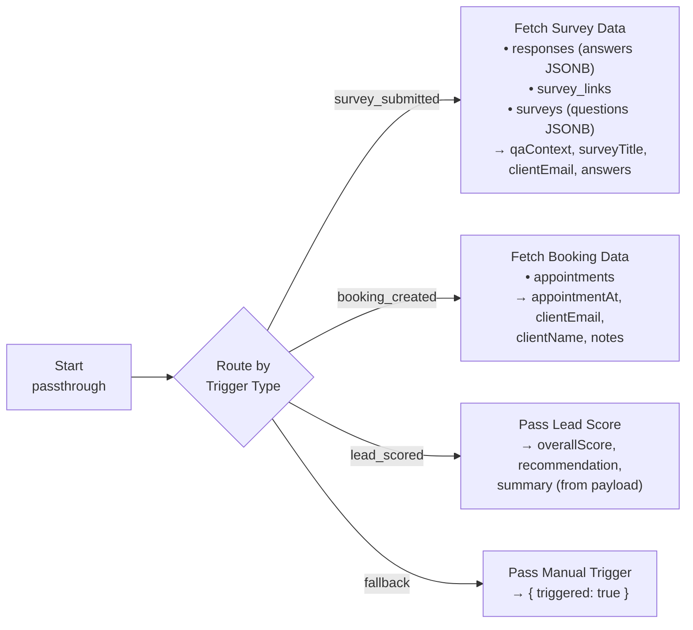

---

## 4. Variable Context Accumulation

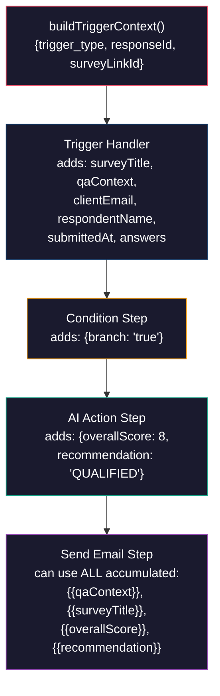

---

## 5. State Management — staticData vs Item Data

```mermaid
flowchart LR
    subgraph Problem["❌ Without staticData"]
        I1["Iteration 1<br/>item.variableContext = {A}"] --> SIB1[SplitInBatches]
        SIB1 --> I2["Iteration 2<br/>item.variableContext = {} ← RESET!"]
    end

    subgraph Solution["✅ With staticData"]
        J1["Iteration 1<br/>state.variableContext = {A}"] --> SIB2[SplitInBatches]
        SIB2 --> J2["Iteration 2<br/>state.variableContext = {A} ← PERSISTS!"]
    end

    style Problem fill:#2d1117,stroke:#f85149
    style Solution fill:#0d1117,stroke:#3fb950
```

---

## 6. Condition Branching — Skip Propagation

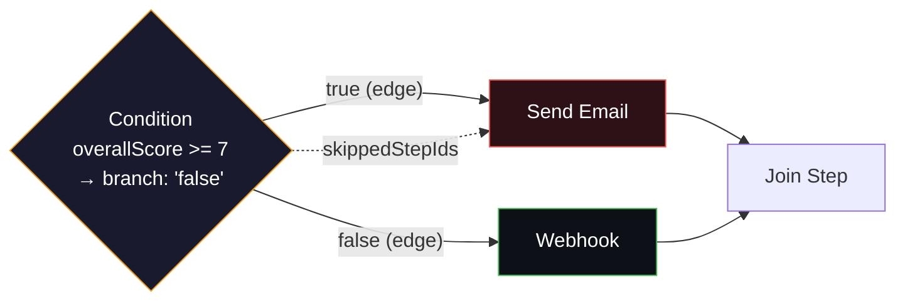

When condition evaluates to `false`:
- `true` branch targets (Send Email) → added to `skippedStepIds`
- `false` branch targets (Webhook) → executed normally
- Skip propagates downstream: if ALL incoming edges of a step are from skipped steps, it's also skipped

---

## 7. Database Schema (ER Diagram)

> Updated 2026-05-01: `workflow_executions.workflow_snapshot`, `workflow_step_executions.attempt_number` + `input_payload NOT NULL` + `status: cancelled` added in T-208/T-209/T-210.

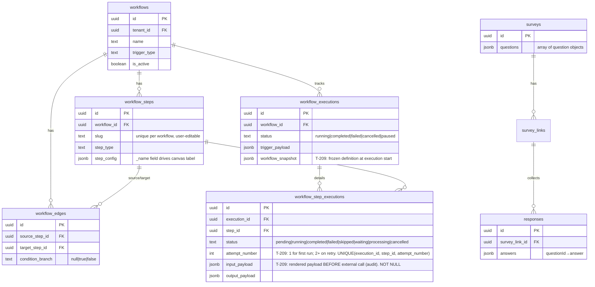

---

## 8. Handler Contract — Data Flow Through executeWorkflow

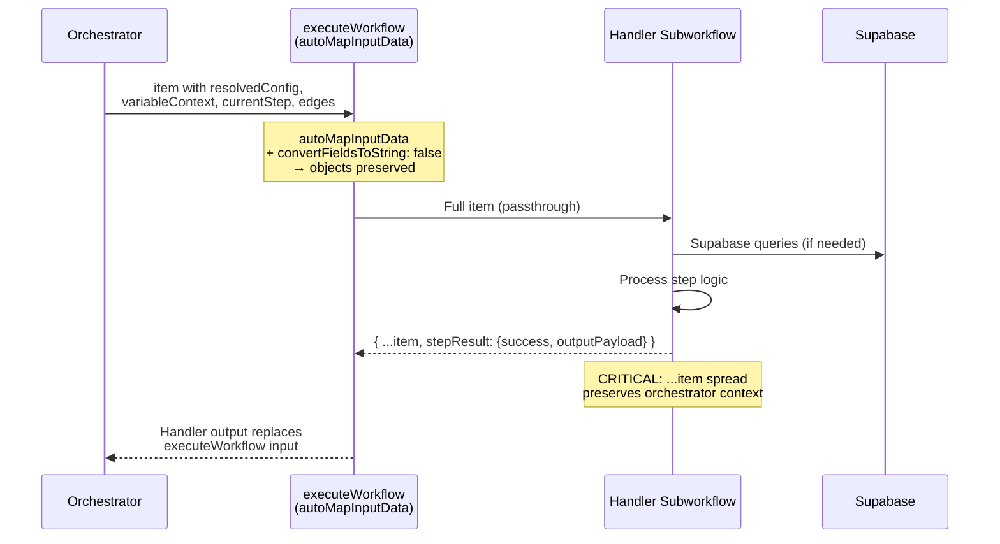

---

## 9. Retry Flow — End to End (T-210)

Retry uruchamiany przez admina z CMS. Wcześniejsze zakończone kroki pomijane (output z cache), nieudane re-runują z aktualnym variableContext.

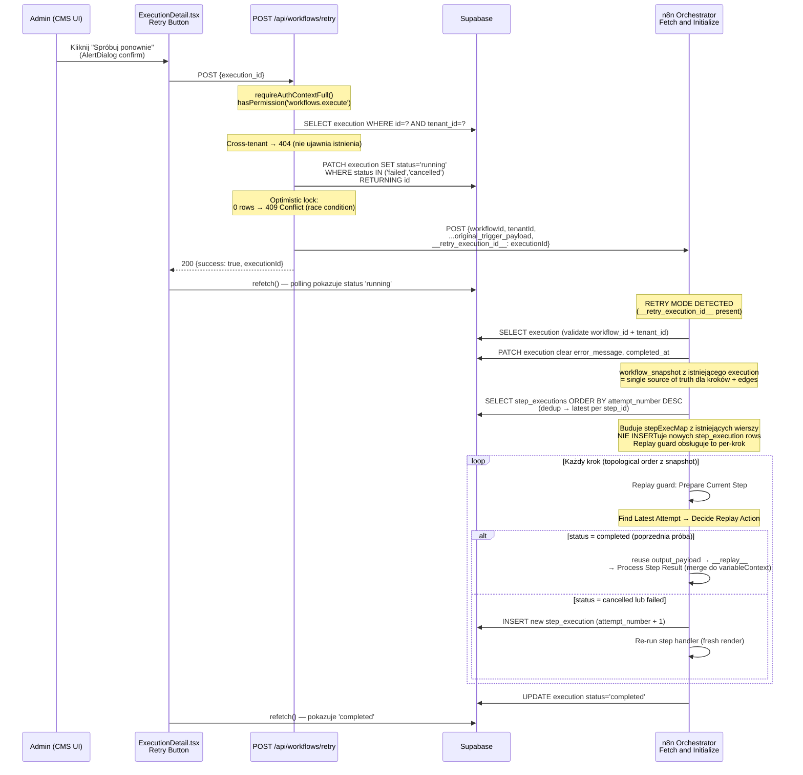

---

## 10. Replay Guard — Decision Tree per krok (T-209/T-210)

Węzły w `Workflow Process Step`: `Find Latest Attempt → Decide Replay Action → Insert New Attempt`.

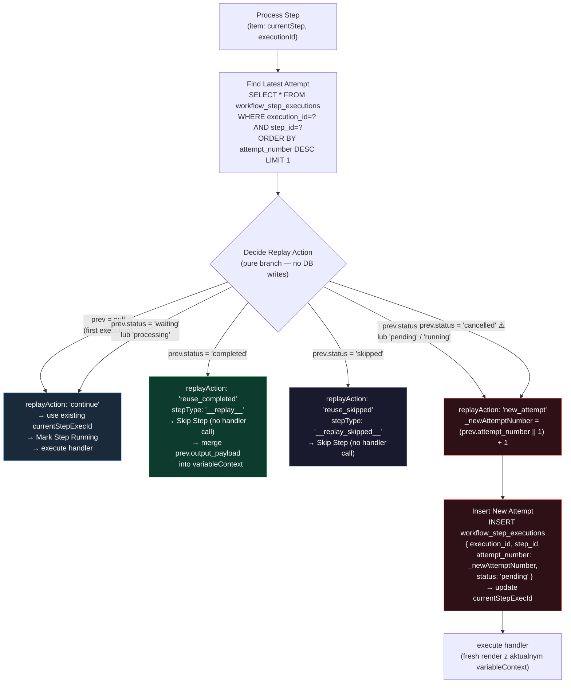

> **⚠️ Dlaczego `cancelled → new_attempt` a nie `→ continue`:**  
> `continue` używałby istniejącego wiersza z `status='cancelled'`. Mark Step Running zrobiłby UPDATE tego wiersza na `status='running'` — niszcząc historyczny zapis anulowania. `new_attempt` tworzy NOWY wiersz z wyższym attempt_number, zostawiając `cancelled` wiersz nienaruszony jako audit trail.

---

## 11. Step Status State Machine (T-209/T-210)

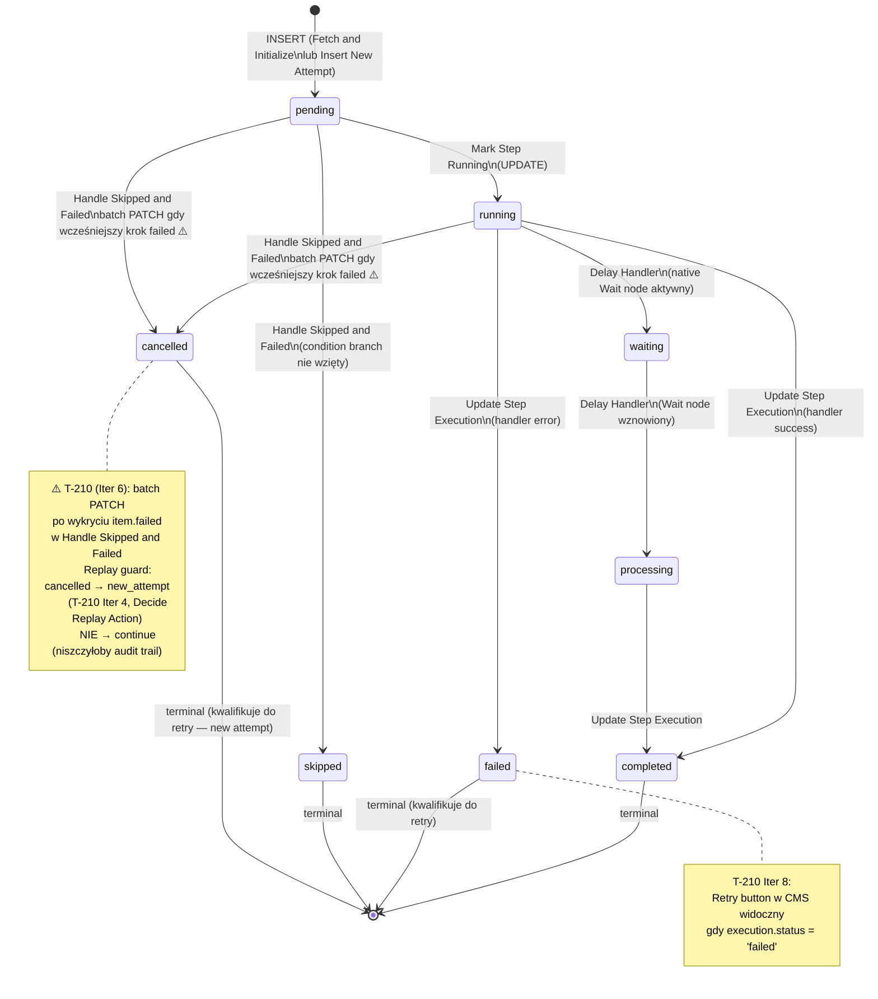

---

## 12. Execution Data Flow — Fresh vs Retry

Porównanie co się dzieje w DB przy pierwszym uruchomieniu vs retry.

```mermaid
flowchart LR
    subgraph FRESH["🆕 Świeże uruchomienie"]
        direction TB
        F1["POST /api/workflows/trigger\n{workflowId, triggerPayload}"]
        F2["Fetch and Initialize:\n• INSERT workflow_executions (uuid nowy)\n• INSERT step_executions × N (attempt_number=1)\n• topologicalSort(live DB steps + edges)\n• workflow_snapshot = frozen definition"]
        F3["Loop kroków:\nMark Running → Handler → Update Execution\nattempt_number zawsze = 1"]
        F4["Koniec:\nUPDATE execution status='completed/failed'"]
        F1 --> F2 --> F3 --> F4
    end

    subgraph RETRY["🔄 Retry (T-210)"]
        direction TB
        R1["POST /api/workflows/retry\n{execution_id}\n↓\noptimistic lock: status failed→running\n↓\nPOST orchestrator z __retry_execution_id__"]
        R2["Fetch and Initialize (retry branch):\n• NIE tworzy nowego execution row\n• NIE tworzy nowych step_execution rows\n• workflow_snapshot z ISTNIEJĄCEGO execution\n  (NIE re-fetches live DB)\n• stepExecMap = SELECT latest per step_id"]
        R3["Loop kroków (replay guard per-step):\n• completed → reuse output_payload (__replay__)\n• cancelled/failed → INSERT attempt_number+1\n  → Handler (fresh render)\n• skipped → reuse skip"]
        R4["Koniec:\nUPDATE execution status='completed'\nStary failed/cancelled row NADAL w DB\n(audit trail)"]
        R1 --> R2 --> R3 --> R4
    end

    subgraph DB_STATE["📊 Stan DB po retry workflow z 3 krokami\n(krok 1 OK, krok 2 failed, krok 3 cancelled)"]
        direction TB
        S1["workflow_step_executions:\n──────────────────────────────────────\nstep_id │ attempt │ status\n────────┼─────────┼──────────────────\nstep_1  │   1     │ completed  (reused)\nstep_2  │   1     │ failed     (historical)\nstep_2  │   2     │ completed  (new attempt)\nstep_3  │   1     │ cancelled  (historical)\nstep_3  │   2     │ completed  (new attempt)"]
    end

    FRESH -.->|"jeśli execution\nzakończyło się błędem"| RETRY
    RETRY --> DB_STATE

    style FRESH fill:#0d1117,stroke:#3fb950
    style RETRY fill:#1a1228,stroke:#8b5cf6
    style DB_STATE fill:#1a1117,stroke:#e85d4a
```
