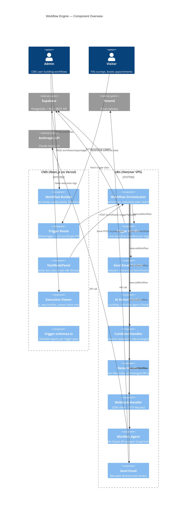
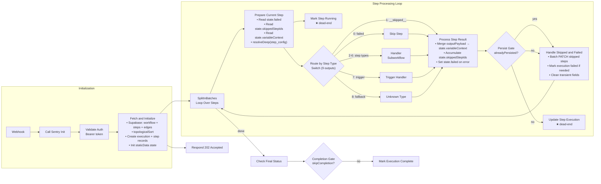
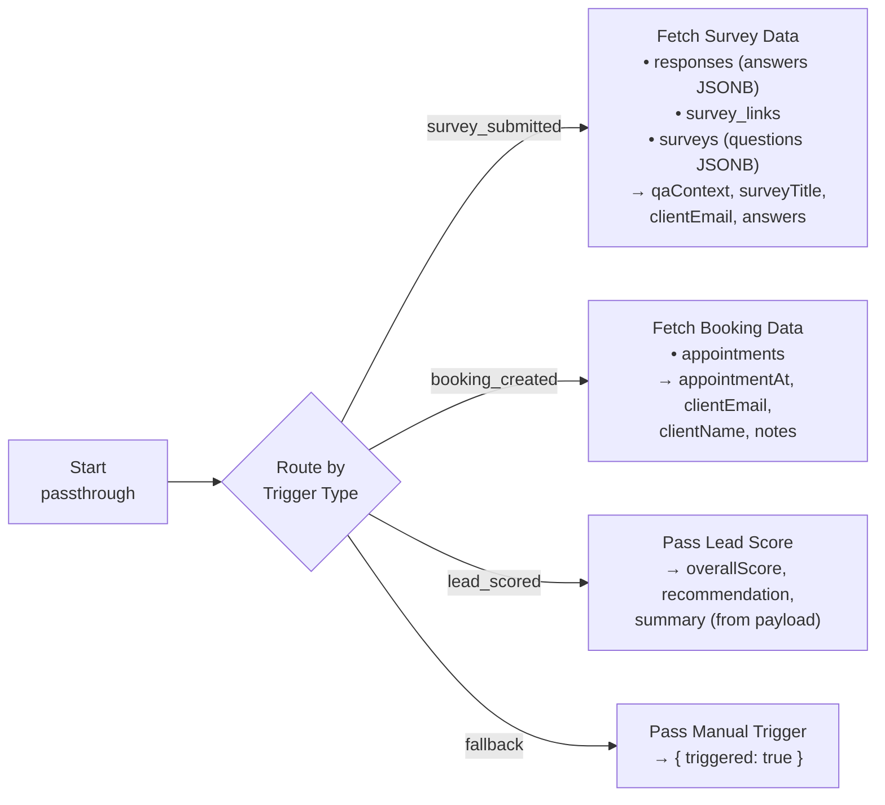
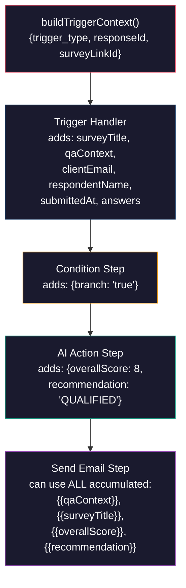
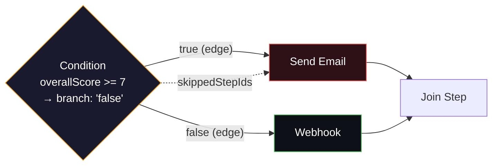
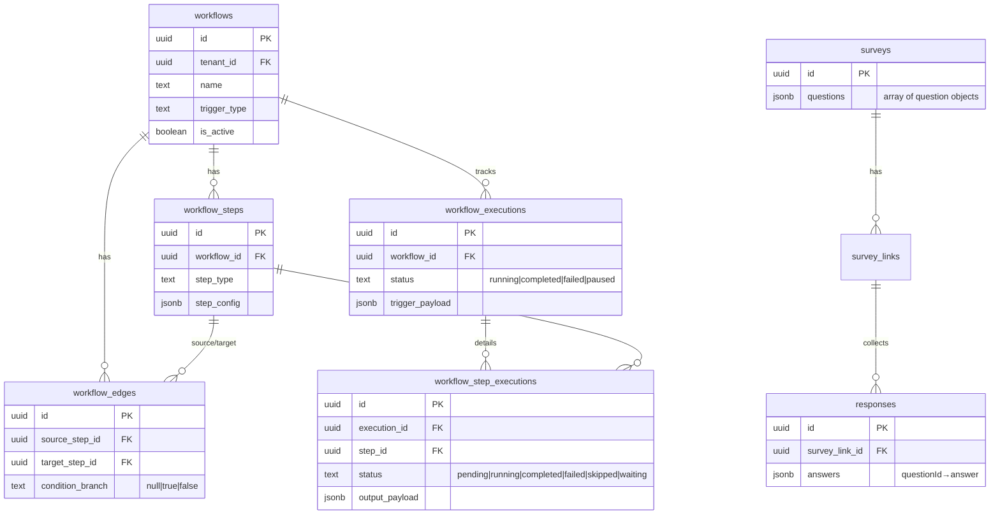
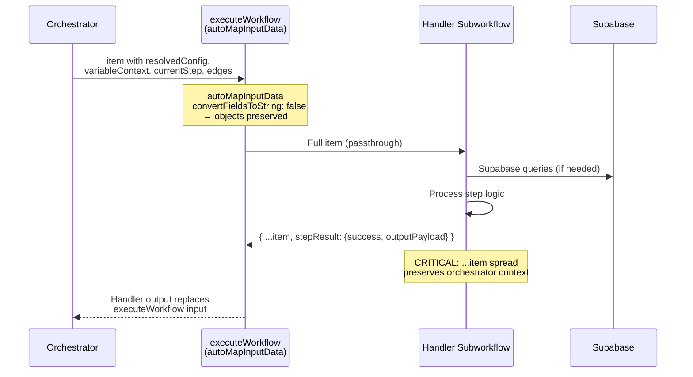

# Workflow Engine — Diagrams

> Updated: 2026-04-12 | All diagrams in Mermaid format

---

## 1. Component Diagram — System Overview

---

## 2. n8n Orchestrator Internal Flow

---

## 3. Trigger Handler Internal Flow

---

## 4. Variable Context Accumulation

---

## 5. State Management — staticData vs Item Data

```mermaid
flowchart LR
    subgraph Problem["❌ Without staticData"]
        I1["Iteration 1<br/>item.variableContext = {A}"] --> SIB1[SplitInBatches]
        SIB1 --> I2["Iteration 2<br/>item.variableContext = {} ← RESET!"]
    end

    subgraph Solution["✅ With staticData"]
        J1["Iteration 1<br/>state.variableContext = {A}"] --> SIB2[SplitInBatches]
        SIB2 --> J2["Iteration 2<br/>state.variableContext = {A} ← PERSISTS!"]
    end

    style Problem fill:#2d1117,stroke:#f85149
    style Solution fill:#0d1117,stroke:#3fb950
```

---

## 6. Condition Branching — Skip Propagation

When condition evaluates to `false`:
- `true` branch targets (Send Email) → added to `skippedStepIds`
- `false` branch targets (Webhook) → executed normally
- Skip propagates downstream: if ALL incoming edges of a step are from skipped steps, it's also skipped

---

## 7. Database Schema (ER Diagram)

---

## 8. Handler Contract — Data Flow Through executeWorkflow

