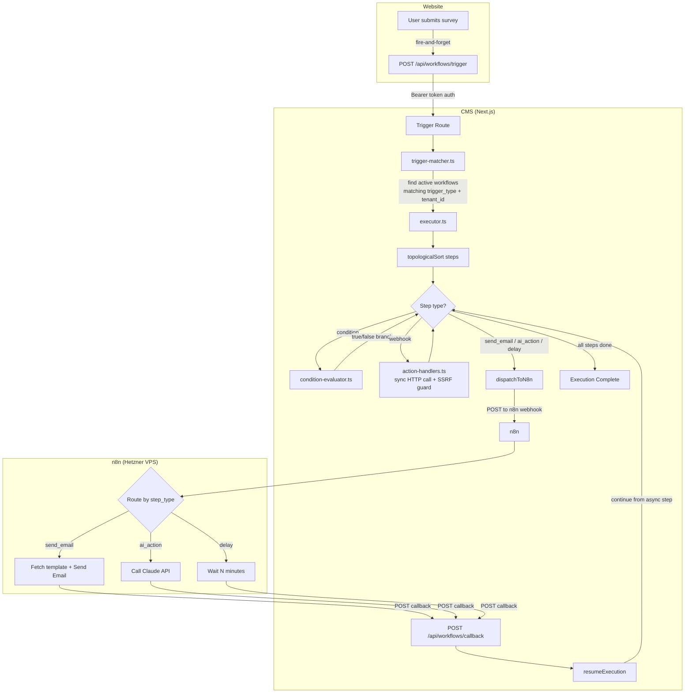
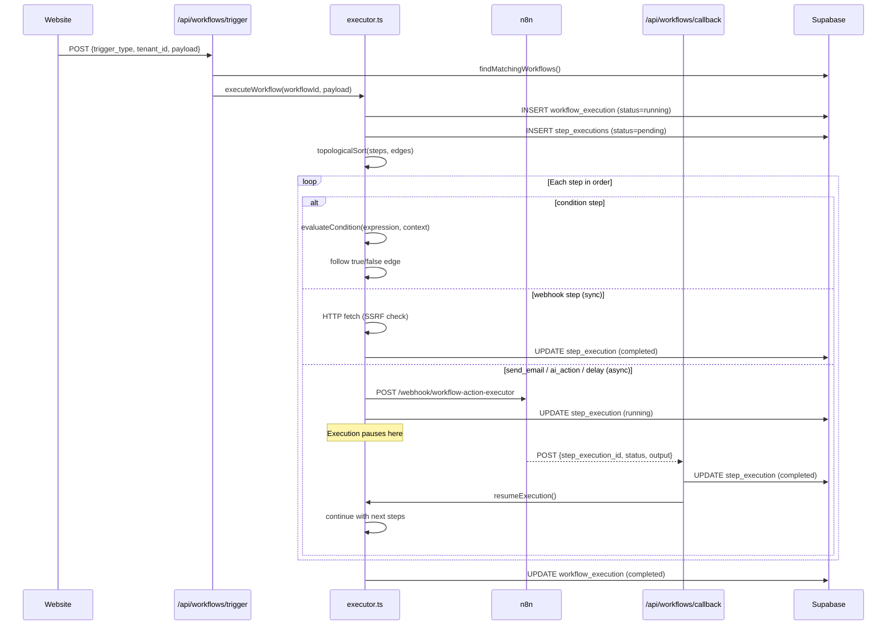
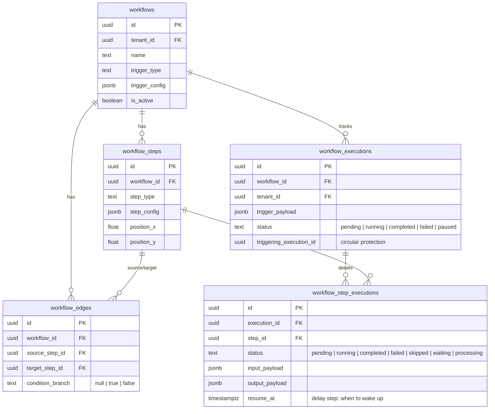

# Workflow Engine — Architecture Guide

## Overview

Per-tenant automation engine. Admins build workflows visually in CMS (ReactFlow canvas), the engine executes them when events occur (e.g. survey submission). Heavy steps (email, AI, delay) are dispatched to n8n asynchronously — CMS handles orchestration, n8n handles execution.

**Two-layer split:**
- **CMS** — trigger matching, step sequencing (topological sort), condition evaluation, webhook calls, state management
- **n8n** — async step execution (send_email, ai_action, delay) + callback to CMS when done

---

## System Flow



---

## Data Flow — Single Execution



---

## Component Map

### Engine (`features/workflows/engine/`)

| File | Purpose |
|------|---------|
| `executor.ts` | Core loop — `executeWorkflow()`, `resumeExecution()`, `runPendingSteps()` |
| `trigger-matcher.ts` | `findMatchingWorkflows(triggerType, tenantId)` — indexed query on active workflows |
| `condition-evaluator.ts` | Parses `"field operator value"` expressions (==, !=, >, <, contains, in). No `eval()` |
| `action-handlers.ts` | Step handler registry — `dispatchToN8n()` for async, `handleWebhook()` for sync |
| `utils.ts` | `topologicalSort()` (Kahn's algorithm), `resolveVariables()` for `{{mustache}}` templates |
| `types.ts` | `ExecutionContext`, `TriggerPayload` (discriminated union), `ActionResult` |

### API Routes

| Route | Method | Purpose |
|-------|--------|---------|
| `/api/workflows/trigger` | POST | Entry point — Bearer token auth, finds + executes matching workflows |
| `/api/workflows/callback` | POST | n8n calls this when async step completes. Idempotent (ignores re-delivery) |
| `/api/workflows/process-due-delays` | POST | Batch endpoint — claims and resumes delay steps where `resume_at <= now()` |
| `/api/workflows/resume` | POST | Single-step resume — accepts `step_execution_id`, resumes immediately |

### Visual Builder (`features/workflows/components/`)

| Component | Purpose |
|-----------|---------|
| `WorkflowCanvas.tsx` | ReactFlow canvas — nodes, edges, connections. Dynamic import (~150KB) |
| `nodes/node-registry.ts` | `NODE_TYPE_CONFIGS` — icon, label, border color per step type |
| `nodes/{Trigger,Action,Condition,Delay}Node.tsx` | Custom ReactFlow node components |
| `panels/ConfigPanelWrapper.tsx` | Routes selected node → correct config panel |
| `panels/{SendEmail,Condition,Delay,Webhook,AiAction,Trigger}ConfigPanel.tsx` | Per-type configuration forms |

### CMS Foundation (`features/workflows/`)

| File | Purpose |
|------|---------|
| `types.ts` | Domain types — `TriggerType`, `StepType`, `ExecutionStatus`, config unions, label records |
| `queries.ts` | TanStack Query hooks (browser) |
| `queries.server.ts` | Server-side data fetching |
| `actions.ts` | Server Actions — CRUD + canvas bulk save |
| `validation.ts` | Zod schemas for trigger/step configs |

---

## Database Schema



**RLS strategy:** `workflows`, `workflow_steps`, `workflow_edges` — tenant-scoped via `current_user_tenant_id()`. Execution tables — SELECT-only for CMS users, writes via `service_role` client (engine bypasses RLS).

---

## Types at a Glance

**Trigger types:** `survey_submitted` | `booking_created` | `lead_scored` | `manual` | `scheduled`

**Step types:** `send_email` (async/n8n) | `delay` (async/n8n) | `ai_action` (async/n8n) | `condition` (sync) | `webhook` (sync)

**Execution statuses:** `pending` → `running` → `completed` | `failed` | `cancelled` | `paused`

**Step statuses:** `pending` → `running` → `completed` | `failed` | `skipped` | `waiting` → `processing`

---

## Protections

| Protection | Where | How |
|------------|-------|-----|
| **Circular trigger** | `executor.ts` | `triggering_execution_id` tracks depth. Blocks depth >= 2 |
| **SSRF** | `action-handlers.ts` | Private IP blocklist (127.*, 10.*, 192.168.*, ::1, localhost) before `fetch()` |
| **Race condition** | `callback/route.ts` | Optimistic lock + idempotency guard on concurrent n8n callbacks |
| **Condition safety** | `condition-evaluator.ts` | Parsed expressions only — no `eval()`, fail-closed on parse error |
| **Auth** | Both API routes | `WORKFLOW_TRIGGER_SECRET` Bearer token (service-to-service) |
| **Timeout** | `action-handlers.ts` | `AbortSignal.timeout(10_000)` on webhook calls |

---

## Variable System

Steps accumulate context — each step's `outputPayload` merges into context for subsequent steps.

```
Trigger payload: { responseId: "abc", surveyLinkId: "xyz" }
    ↓
Step 1 (webhook) output: { statusCode: 200, responseBody: { score: 8 } }
    ↓
Context for Step 2: { responseId: "abc", surveyLinkId: "xyz", statusCode: 200, score: 8 }
```

Templates use `{{mustache}}` syntax: `{{responseId}}`, `{{responseBody.score}}`. Resolved by `resolveVariables()` in `engine/utils.ts`.

---

## Adding a New Step Type

1. **`types.ts`** — add to `StepType` union + `StepConfig` discriminated union + labels
2. **`validation.ts`** — add Zod schema for the new config
3. **`engine/action-handlers.ts`** — add handler to `stepHandlers` registry
4. **`components/nodes/node-registry.ts`** — add to `NODE_TYPE_CONFIGS`
5. **`components/panels/`** — create config panel + register in `PANEL_REGISTRY`

That's it — 5 files, no changes to executor or canvas logic.

---

## Adding a New Trigger Type

1. **`types.ts`** — add to `TriggerType` union + `TriggerConfig` union + labels
2. **`validation.ts`** — add Zod schema
3. **`engine/types.ts`** — add to `TriggerPayload` discriminated union
4. **`engine/utils.ts`** — add case in `buildTriggerContext()`
5. **Caller** — add fire-and-forget POST to `/api/workflows/trigger` from the event source

---

## Delay Step Architecture (AAA-T-150)

### Problem

Workflows need to "wait" (e.g. 2 days before sending a follow-up email). `setTimeout` is not an option -- it dies on server restart. Blocking an n8n worker for days wastes resources and blocks the queue.

### Solution -- 3 Components

The delay is **persisted to database**, not held in memory. Three components cooperate to pause and resume execution:

#### 1. handleDelay (`engine/action-handlers.ts`)

When the executor hits a step of type `delay`:

1. Computes `resume_at = now() + (value x unit)` from `step_config`
2. Writes to DB: `workflow_step_executions.status = 'waiting'`, `resume_at = computed timestamp`
3. Sets `workflow_executions.status = 'paused'`
4. Does **NOT** dispatch to n8n (unlike `send_email` / `ai_action`)
5. Stops execution -- the workflow "goes to sleep"

#### 2. n8n Workflow: Delay Processor (cron every 5 min)

A minimal n8n workflow that fires on a 5-minute cron schedule. It does one thing:

- `POST /api/workflows/process-due-delays`

That's it -- n8n is a dumb timer. All logic lives in CMS.

#### 3. POST `/api/workflows/process-due-delays` (batch endpoint in CMS)

This route wakes up sleeping workflows:

1. Calls `claim_due_delay_steps(limit)` -- a PostgreSQL RPC function that **atomically** claims steps where `status = 'waiting' AND resume_at <= now()` using `FOR UPDATE SKIP LOCKED`
2. For each claimed step:
   - Marks `workflow_step_executions.status = 'completed'`
   - Sets `workflow_executions.status = 'running'`
   - Calls `resumeExecution()` from the engine -- workflow continues from the next step

### Bonus: POST `/api/workflows/resume` (single-step endpoint)

For manual testing or future use cases. Accepts a specific `step_execution_id` and resumes that one step immediately (ignores `resume_at`). Useful for debugging or admin "force resume" actions.

### Why FOR UPDATE SKIP LOCKED?

If two n8n cron calls overlap (e.g. n8n fires two instances simultaneously), without locking both would claim the same rows and process them twice (duplicate emails, duplicate AI calls). `SKIP LOCKED` ensures each worker only picks up rows that no other transaction is holding -- safe concurrent processing without duplicates.

### Flow Diagram

```
Trigger workflow
    -> executor hits delay step
    -> handleDelay writes resume_at to DB
    -> step: 'waiting', execution: 'paused'
    -> [workflow sleeps]

n8n cron (every 5 min)
    -> POST /api/workflows/process-due-delays
    -> claim_due_delay_steps() finds resume_at <= now()
    -> step: 'processing' -> 'completed'
    -> execution: 'paused' -> 'running'
    -> resumeExecution() continues workflow
    -> [workflow wakes up, next step runs]
```

### step_config Format

```json
{ "type": "delay", "value": 2, "unit": "days" }
```

Supported units: `"minutes"` | `"hours"` | `"days"`

### DB Changes (AAA-T-150)

| Change | Purpose |
|--------|---------|
| `workflow_step_executions.resume_at TIMESTAMPTZ` | When to wake up the step |
| New status: `waiting` (step) | Step is sleeping, waiting for `resume_at` |
| New status: `processing` (step) | Step has been claimed by `claim_due_delay_steps()`, being processed |
| New status: `paused` (execution) | Entire workflow execution is paused (waiting for a delay) |
| `idx_wse_waiting_resume` partial index | `WHERE status = 'waiting'` -- fast polling queries for due steps |
| `claim_due_delay_steps(limit INT)` RPC | Atomic claim with `FOR UPDATE SKIP LOCKED` -- prevents double-processing |

### Key Design Decision: Delay Runs in CMS, Not n8n

Unlike `send_email` and `ai_action` which dispatch to n8n for execution, `delay` is handled entirely in CMS + database. n8n only provides the cron trigger. This avoids tying up an n8n worker for hours/days and keeps delay state queryable in the CMS database (important for the Execution Logs UI in iteration 8).

---

> **Remaining plan:** See [WORKFLOW_PLAN.md](./WORKFLOW_PLAN.md)
