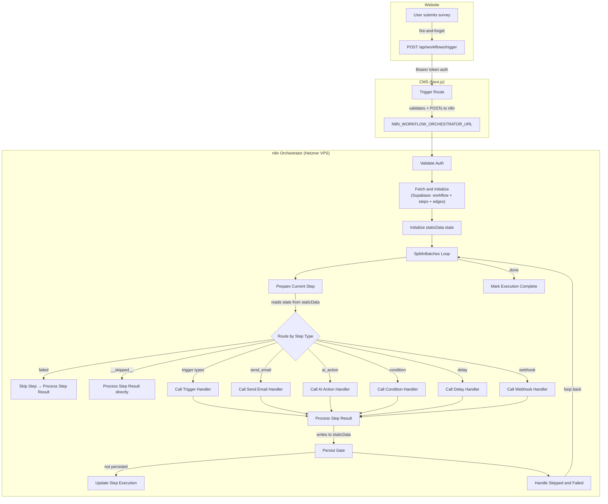
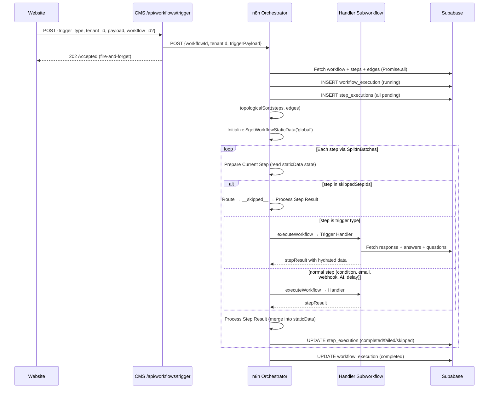
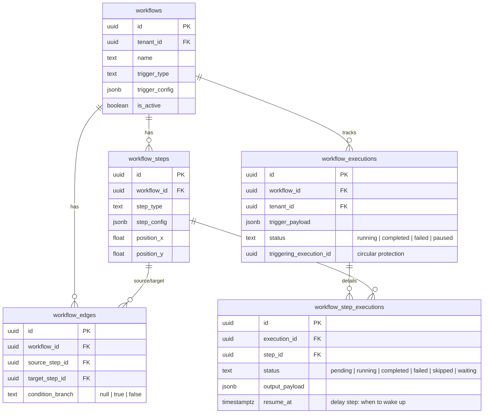

# Workflow Engine — Architecture Guide

> Updated: 2026-04-12 | Relates to: AAA-T-183 (n8n Orchestrator migration)

## Overview

Per-tenant automation engine. Admins build workflows visually in CMS (ReactFlow canvas). When events occur (survey submission, booking, AI scoring), a fire-and-forget POST triggers the n8n Orchestrator which owns ALL execution — no CMS callbacks, no resume routes, no delay polling.

**Execution split (post-migration):**
- **CMS** — trigger route (~70 LOC fire-and-forget), visual builder UI, test mode, execution log viewer
- **n8n Orchestrator** — fetches workflow definition from Supabase, dispatches steps to handler subworkflows, writes all state directly to Supabase

**Why n8n owns ALL execution:** Vercel serverless has a 5-10 min timeout. Multi-hour delay steps are impossible. n8n's native Wait node serializes execution state and resumes without polling — no cron, no `claim_due_delay_steps()` RPC. This eliminated 874 LOC from CMS (executor.ts, action-handlers.ts, trigger-matcher.ts, 3 API routes).

---

## System Flow



---

## Data Flow — Single Execution



---

## n8n Orchestrator Internals

### State Management: `$getWorkflowStaticData('global')`

**Problem:** n8n's SplitInBatches gives each iteration a fresh original item from its input queue. State accumulated during iteration N (variableContext updates, skippedStepIds, failed flag) is completely lost at iteration N+1.

**Solution:** `$getWorkflowStaticData('global')` — a mutable object that persists across all node executions within the same workflow run.

| Where | What |
|-------|------|
| **Fetch and Initialize** | `state.variableContext = buildTriggerContext(...)`, `state.skippedStepIds = []`, `state.failed = false` |
| **Prepare Current Step** | Reads `state.failed`, `state.skippedStepIds`, `state.variableContext` to determine skip/fail/resolve |
| **Process Step Result** | `Object.assign(state.variableContext, outputPayload)`, `state.skippedStepIds.push(...)`, `state.failed = true` |

### Route by Step Type (Switch Node)

**Order matters.** 9 outputs, `failed` MUST be first:

| Index | Condition | Target | Why this order |
|-------|-----------|--------|----------------|
| 0 | `$json.failed === true` | Skip Step | Failed items have no `stepType` — must catch before type checks |
| 1 | `stepType === '__skipped__'` | Process Step Result | Direct passthrough, no handler |
| 2 | `stepType === 'send_email'` | Call Send Email Handler | |
| 3 | `stepType === 'ai_action'` | Call AI Action Handler | |
| 4 | `stepType === 'webhook'` | Call Webhook Handler | |
| 5 | `stepType === 'condition'` | Call Condition Handler | |
| 6 | `stepType === 'delay'` | Call Delay Handler | |
| 7 | `stepType in trigger_types` | Call Trigger Handler | OR combinator across 5 types |
| 8 | fallback (extra) | Unknown Type Handler | |

### executeWorkflow Configuration

ALL handler calls use:
- `mappingMode: "autoMapInputData"` — sends full pipeline data to subworkflow
- `convertFieldsToString: false` — preserves object types (resolvedConfig, variableContext, edges)

**Why not `defineBelow`:** With empty `value: {}` and `convertFieldsToString: false`, n8n sends literally nothing. With `convertFieldsToString: true`, it sends everything but as strings (`resolvedConfig` becomes `"[object Object]"`). Both are wrong. `autoMapInputData` sends the real objects.

### Dead-End Pattern (Fire-and-Forget DB Writes)

n8n Supabase UPDATE nodes replace pipeline data with the DB row. When pipeline data must continue downstream:
- **Mark Step Running** → dead-end (`"main": [[]]`), no output connections
- **Update Step Execution** → dead-end, no output connections
- Pipeline continues via parallel connection from upstream node

### Trigger Steps as Real Steps

Trigger types (`survey_submitted`, `booking_created`, etc.) are **NOT filtered out** from the step list. They execute as the first step via the Trigger Handler subworkflow, which fetches actual data from Supabase and puts it into `outputPayload`. This is merged into `state.variableContext` so all downstream steps see real data (survey answers, client email, etc.) — not just UUIDs.

---

## CMS Engine Files (`features/workflows/engine/`)

| File | Purpose |
|------|---------|
| `types.ts` | `ExecutionContext`, `TriggerPayload` (discriminated union), `VariableContext` — shared by UI + test mode |
| `utils.ts` | `topologicalSort` (Kahn's BFS), `resolveVariables` (mustache), `buildTriggerContext` — used by canvas UI + variable inserter |
| `condition-evaluator.ts` | Expression parser (no eval), operators — used by condition config panel preview |

**Deleted files (AAA-T-183):** `executor.ts`, `action-handlers.ts`, `trigger-matcher.ts` — all execution moved to n8n.

## API Routes

| Route | Method | Purpose |
|-------|--------|---------|
| `/api/workflows/trigger` | POST | Entry point — Bearer token auth, validates, POSTs to n8n Orchestrator. Returns 202 |

**Deleted routes (AAA-T-183):** `/api/workflows/callback`, `/api/workflows/resume`, `/api/workflows/process-due-delays`

---

## Database Schema



**RLS strategy:** `workflows`, `workflow_steps`, `workflow_edges` — tenant-scoped via `current_user_tenant_id()`. Execution tables — SELECT-only for CMS users, writes via `service_role` client (n8n Orchestrator uses service role key directly).

**Data model notes:**
- Survey answers are in `responses.answers` JSONB (`{ questionId: "answer" }`) — no separate `survey_answers` table
- Survey questions are in `surveys.questions` JSONB (array) — no separate `questions` table

---

## Variable System

### Accumulation Flow

```
1. buildTriggerContext() → { trigger_type, responseId, surveyLinkId }
   ↓
2. Trigger Handler fetches data → adds { surveyTitle, qaContext, clientEmail, answers, respondentName, submittedAt }
   ↓
3. Condition step evaluates → adds { branch: "true" }
   ↓
4. AI Action step → adds { overallScore: 8, recommendation: "QUALIFIED" }
   ↓
5. Send Email step → can use all of: {{qaContext}}, {{surveyTitle}}, {{overallScore}}, {{recommendation}}
```

State accumulates in `$getWorkflowStaticData('global').variableContext`. Each step's `outputPayload` is merged via `Object.assign()` in Process Step Result.

### Template Resolution

Templates use `{{mustache}}` syntax: `{{responseId}}`, `{{qaContext}}`. Resolved by `resolveDeep()` in Prepare Current Step using accumulated variableContext from staticData.

### CMS Variable Registry

`lib/trigger-schemas.ts` defines available `{{variables}}` per trigger type. Used by VariableInserter in config panels. Must match what Trigger Handler actually produces:

| Trigger | Variables |
|---------|-----------|
| `survey_submitted` | `respondentName`, `clientEmail`, `surveyTitle`, `qaContext`, `submittedAt`, `responseId`, `surveyLinkId` |
| `booking_created` | `clientName`, `clientEmail`, `appointmentAt`, `notes`, `appointmentId` |
| `lead_scored` | `overallScore`, `recommendation`, `summary`, `responseId` |

---

## Condition Branching

**Expression format:** `"field operator value"` — e.g. `"overallScore >= 10"`

**Parser:** String-based, no `eval()`. Operators checked in order: `>=`, `<=`, `!=`, `==`, `>`, `<`, `contains`, `in`.

**Return values:** `'true'` or `'false'` as strings — matching `condition_branch` values on `workflow_edges`.

**Literal value fallback:** Prepare Current Step pre-resolves `{{variables}}` before condition handler runs. Expression `"overallScore >= 5"` becomes `"7 >= 5"`. If left operand is not found in variableContext (because it's now a literal), handler treats it as a literal value via `coerceNumeric()`. Without this, pre-resolved comparisons always evaluate to false.

**Skip propagation:** After condition evaluates to branch X, the non-taken branch's target steps are added to `skippedStepIds` (only if ALL their incoming edges are on the non-taken branch). Propagates recursively downstream.

---

## Delay Step

**No CMS involvement.** n8n Delay Handler:
1. Computes duration from `step_config.value` + `step_config.unit`
2. PATCHes step_execution = `waiting`, workflow_execution = `paused`
3. n8n native **Wait node** sleeps (serializes execution state, resumes automatically)
4. After wake: PATCHes step_execution = `completed`, workflow_execution = `running`
5. Returns `alreadyPersisted: true` so Orchestrator skips its own DB write

**Supported units:** `"minutes"` | `"hours"` | `"days"` (converted to seconds for Wait node with `unit: "seconds"`)

---

## Protections

| Protection | Where | How |
|------------|-------|-----|
| **Circular trigger** | Orchestrator Fetch and Initialize | `triggering_execution_id` tracks depth. Blocks depth >= 2 |
| **SSRF** | Webhook Handler subworkflow | Private IP regex blocklist before HTTP Request. Uses regex parsing (no `URL` constructor in n8n sandbox) |
| **Condition safety** | Condition Handler subworkflow | Parsed expressions only — no `eval()`, fail-closed on parse error |
| **Auth** | Orchestrator Validate Auth | `ORCHESTRATOR_WEBHOOK_SECRET` Bearer token (CMS → n8n) |
| **Timeout** | Webhook Handler HTTP Request | 10s hard limit |

---

## n8n Workflow Files

| File | Purpose |
|------|---------|
| `Workflow Orchestrator.json` | Main orchestrator — SplitInBatches loop, Switch routing, staticData state |
| `Step - Trigger Handler.json` | Fetches real data per trigger type (survey answers, appointment details) |
| `Step - Send Email Handler.json` | Resolves email template + recipient, calls Send Email subworkflow |
| `Step - AI Action Handler.json` | Builds prompt, calls MiniMax Agent, parses JSON response |
| `Step - Condition Handler.json` | Evaluates expression, computes skippedStepIds |
| `Step - Delay Handler.json` | Computes duration, marks paused, Wait node, marks completed |
| `Step - Webhook Handler.json` | SSRF check + HTTP Request |

All located in `n8n-workflows/workflows/Workflows/`.

---

> **Nodes & triggers reference:** See [WORKFLOW_NODES.md](./WORKFLOW_NODES.md)
> **E2E test guide:** See [WORKFLOW_E2E_TEST.md](./WORKFLOW_E2E_TEST.md)
> **Remaining plan:** See [WORKFLOW_PLAN.md](./WORKFLOW_PLAN.md)
