# N8n Survey Analysis Workflow - Visual Diagrams

## Main Workflow Flow

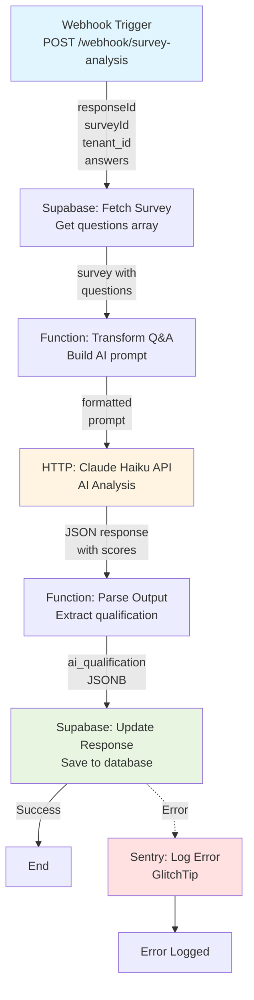

---

## Data Flow Diagram

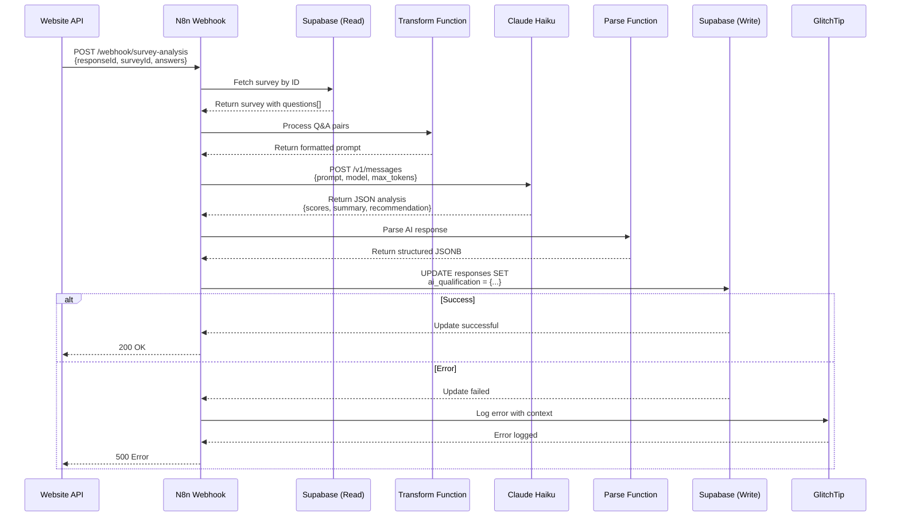

---

## Database Schema

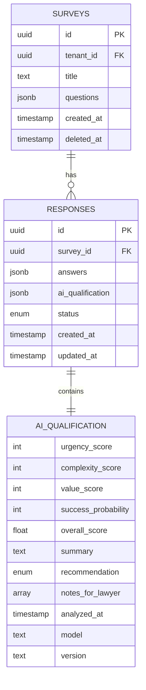

---

## AI Qualification Structure

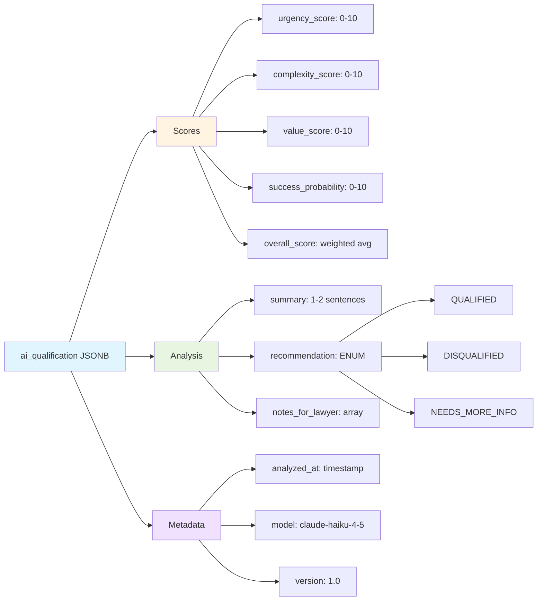

---

## Score Calculation

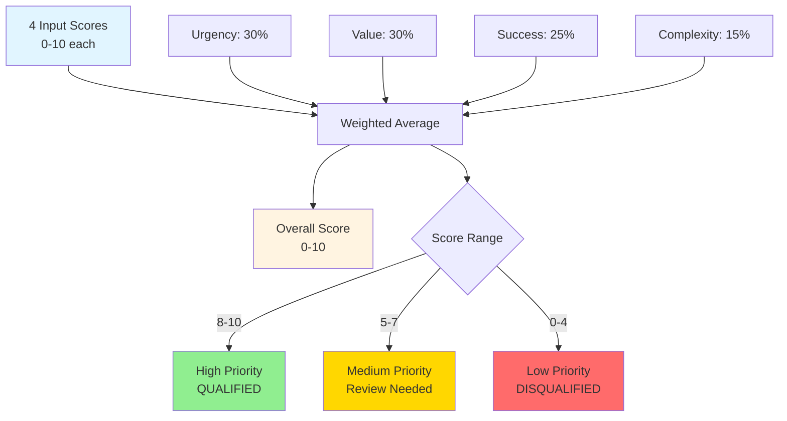

---

## Error Handling Flow

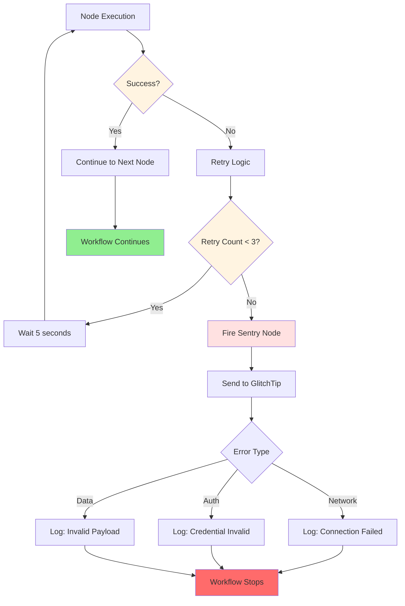

---

## Status Transition Logic

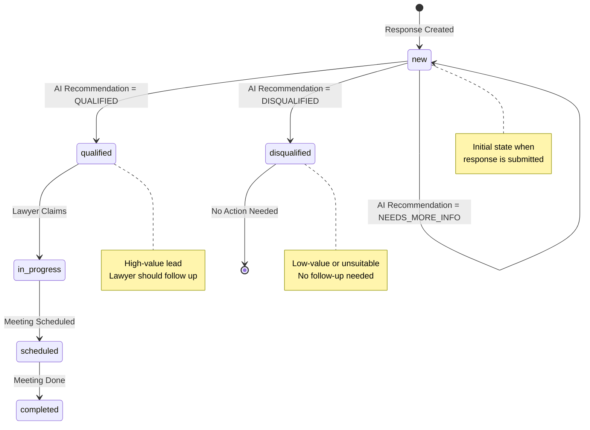

---

## Credential Flow

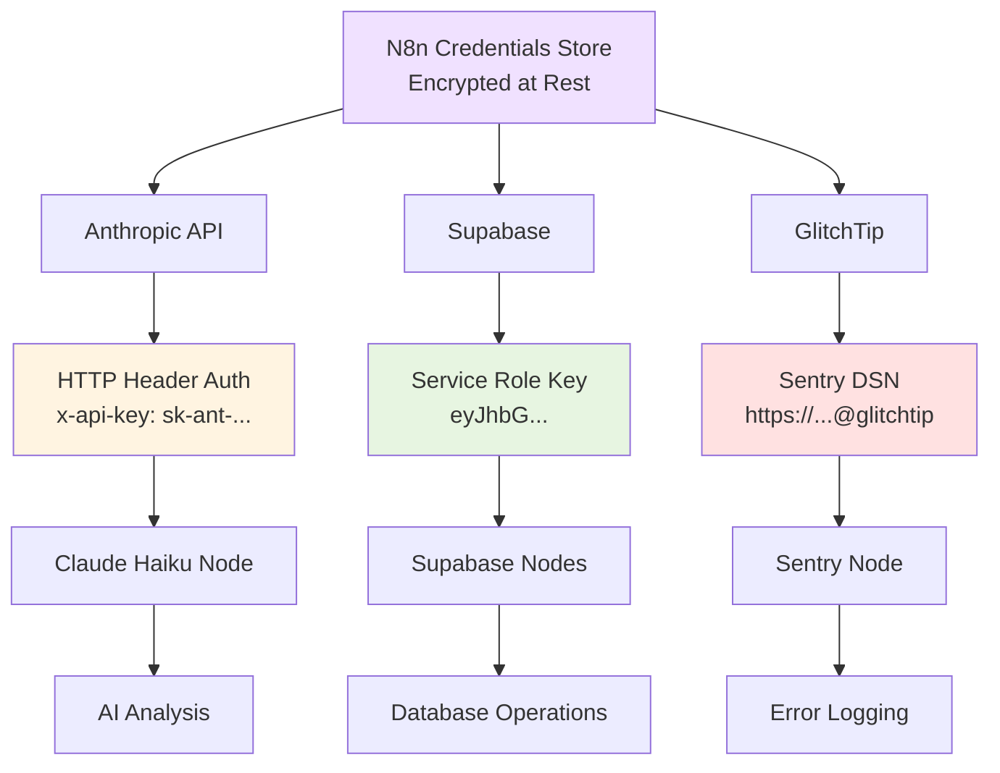

---

## Integration Architecture

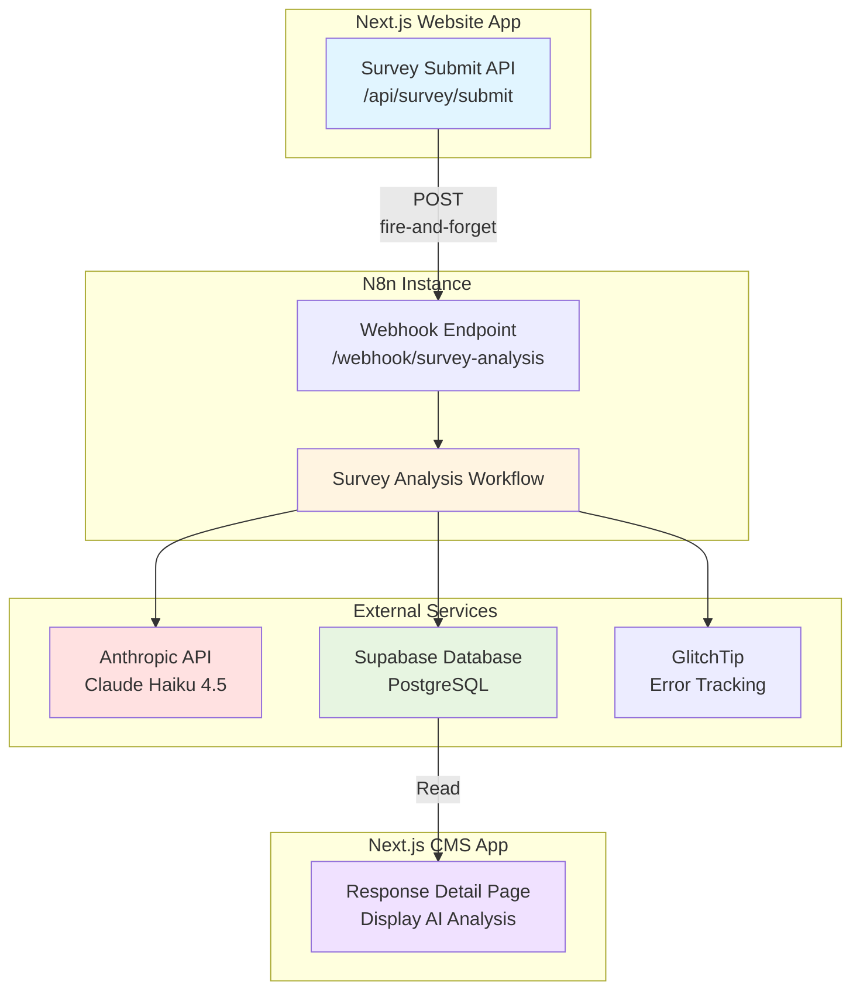

---

## Performance Timeline

```mermaid
gantt
    title Workflow Execution Timeline (Target: <10s)
    dateFormat X
    axisFormat %Ss

    section Nodes
    Webhook Trigger         :0, 100ms
    Supabase Fetch         :100ms, 500ms
    Transform Q&A          :600ms, 50ms
    Claude API Call        :650ms, 5000ms
    Parse Output           :5650ms, 50ms
    Supabase Update        :5700ms, 500ms
    Complete               :6200ms, 1ms

    section Critical Path
    Total Time            :0, 6200ms
```

**Typical Execution:** 5-8 seconds
**Target:** <10 seconds
**Bottleneck:** Claude API (2-5s, normal for AI)

---

## Cost Breakdown

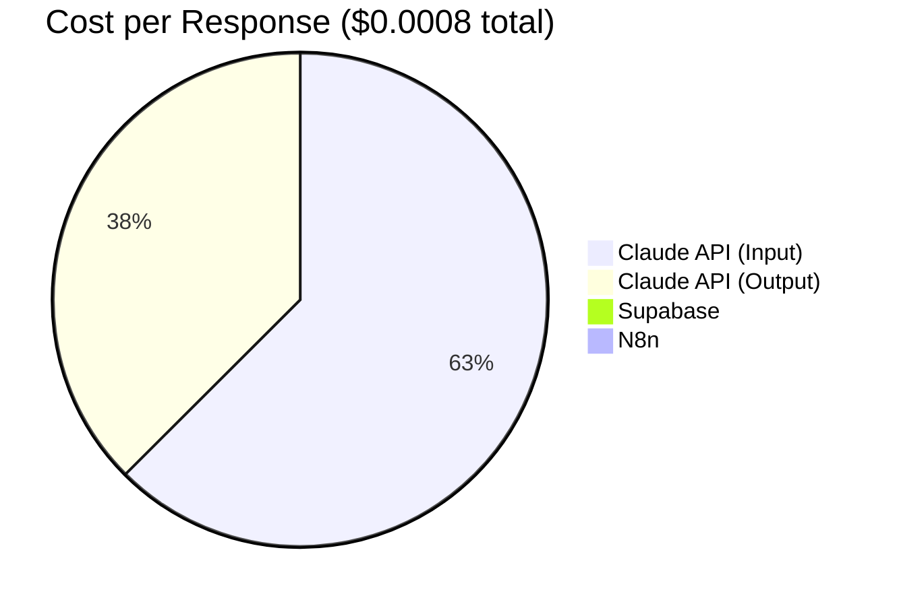

**Monthly Cost Projection:**
- 100 responses = $0.08
- 1,000 responses = $0.80
- 10,000 responses = $8.00

---

## Testing Flow

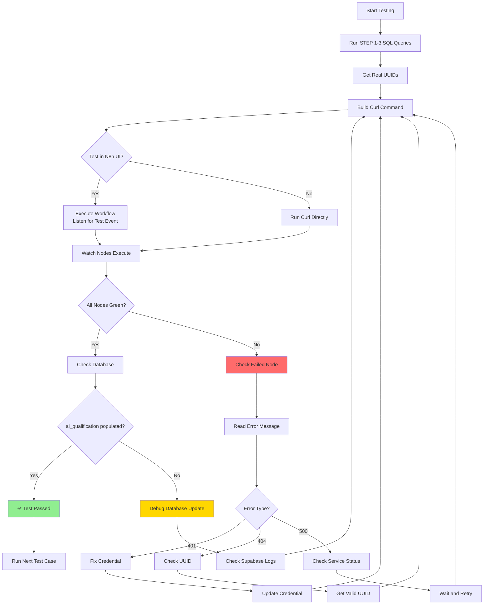

---

## Monitoring Dashboard (Conceptual)

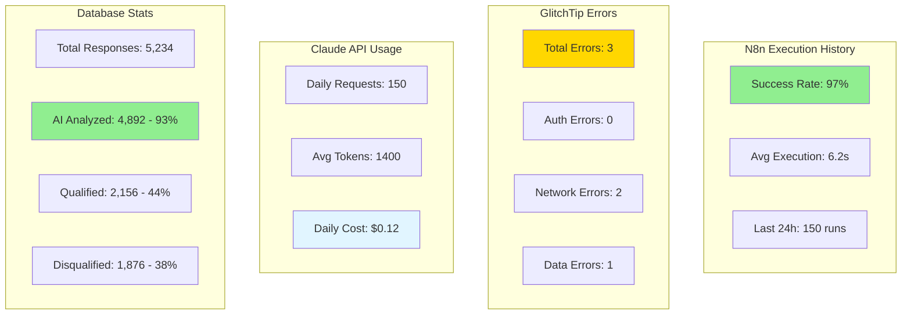

---

## Future Architecture (Phase 2)

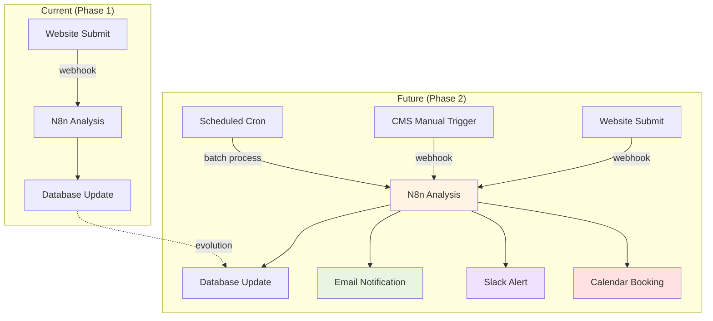

---

## Deployment Checklist Flowchart

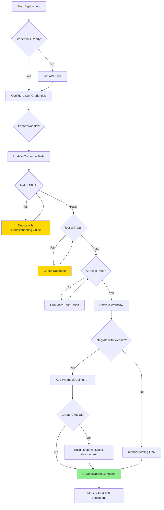

---

## Legend

### Colors
- 🔵 **Blue** - Input/Trigger nodes
- 🟡 **Yellow** - Processing/Transform nodes
- 🟢 **Green** - Success states
- 🔴 **Red** - Error states
- 🟣 **Purple** - Metadata/Configuration

### Symbols
- `→` Synchronous flow
- `-.->` Asynchronous/Error flow
- `⬜` Process node
- `◇` Decision point
- `⬭` Data storage

---

**Note:** These diagrams are written in Mermaid syntax and will render in GitHub, GitLab, and many markdown viewers. If your viewer doesn't support Mermaid, you can paste the code into https://mermaid.live/ to see the rendered diagrams.
